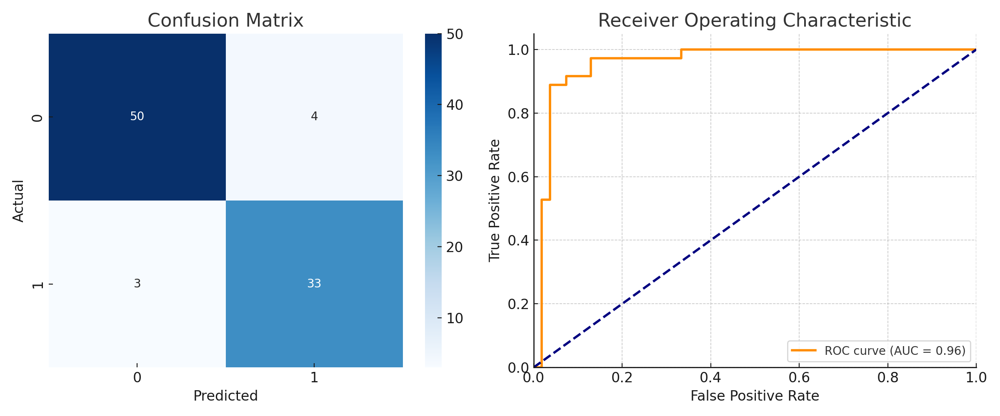

# Customer Churn Prediction

📉 This project demonstrates a machine learning model for predicting customer churn.

---

## 🔧 Tech Stack
- Python, Pandas, NumPy
- scikit-learn (Logistic Regression, Random Forest baseline)
- Jupyter Notebook

---

## 📂 Project Structure
churn-prediction/
data/
churn_synthetic.csv
churn.ipynb
requirements.txt
README.md  

## Quickstart
```bash
# (optional) create a virtual env
python -m venv .venv && source .venv/bin/activate  # on Windows: .venv\Scripts\activate

pip install -r requirements.txt

# open the notebook
jupyter notebook churn.ipynb
```
> If you don't have Jupyter: `pip install notebook`

## What’s Inside
- `data/churn_synthetic.csv` – tiny synthetic dataset (no PII)
- `churn.ipynb` – notebook with EDA, train/test split, logistic regression, metrics
- `requirements.txt` – minimal dependencies

-  


## How to Talk About This Project
- Business Framing: “Predict probability of churn for proactive retention.”
- Features: demo demographics + usage signals
- Metrics: Accuracy, F1, ROC-AUC
- Next Steps: feature engineering, class imbalance handling, advanced models (XGBoost/LightGBM), calibration, cost-based thresholds
